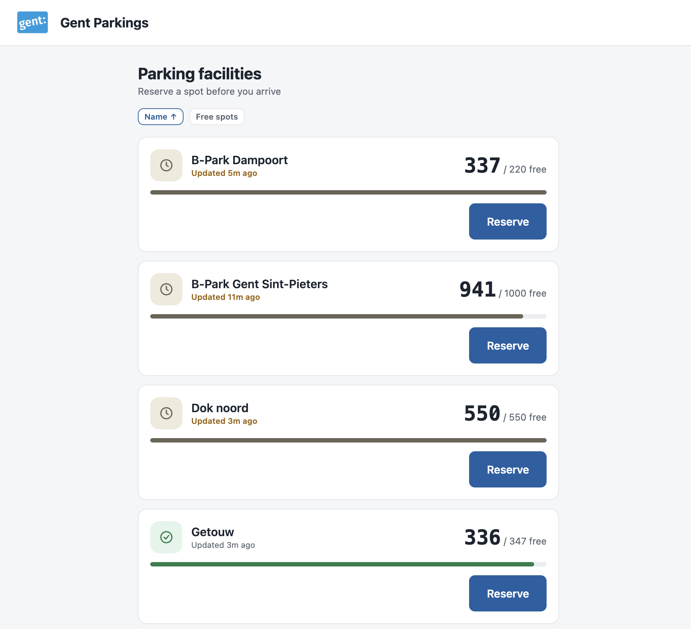
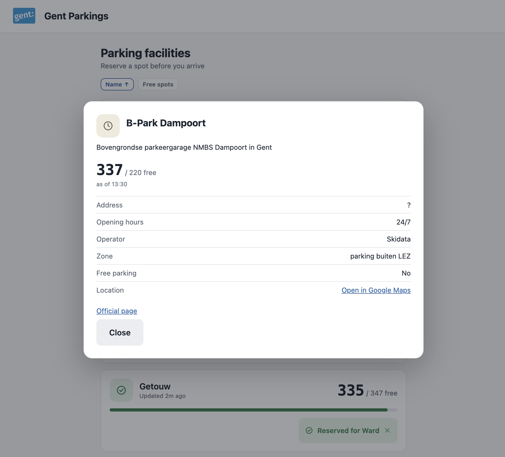

# Gent Parkings

A small frontend practice project: live parking availability for the city of Ghent, with the
ability to reserve (and cancel) a spot ahead of arrival.

It pulls real-time occupancy from Stad Gent's open data feed
([`bezetting-parkeergarages-real-time`](https://data.stad.gent/explore/dataset/bezetting-parkeergarages-real-time))
and layers reservations on top, stored locally in the browser — the public feed is read-only,
so anything you "reserve" here only exists on your own device.

## Screenshots

| Overview | Facility details |
| --- | --- |
|  |  |

## Features

- Live list of every facility, polled every 25s, with a clear visual status (open / filling up
  / full / closed) that never relies on color alone — every state pairs a color with an icon
  and a text label.
- Honest staleness handling: if the feed can't be reached, the last known numbers are shown
  with a clear "showing data as of…" banner rather than a blank or frozen screen. A single
  facility whose own timestamp lags is flagged individually without blocking the rest of the
  app.
- Reserve a spot with your name, see it reflected immediately (optimistic update), and cancel
  it again from the same tag. Reservations survive a page refresh.
- English and Dutch, detected from the browser's language.

## Stack

Vite + React 19 + TypeScript, with the React Compiler doing memoization so the code doesn't
have to. Plain CSS with a small set of design tokens (`src/styles/tokens.css`) — no CSS
framework, no CSS-in-JS. Axios for the one HTTP call. No backend beyond localStorage: this is
a frontend exercise.

## Running it

```bash
npm install
npm run dev
```
